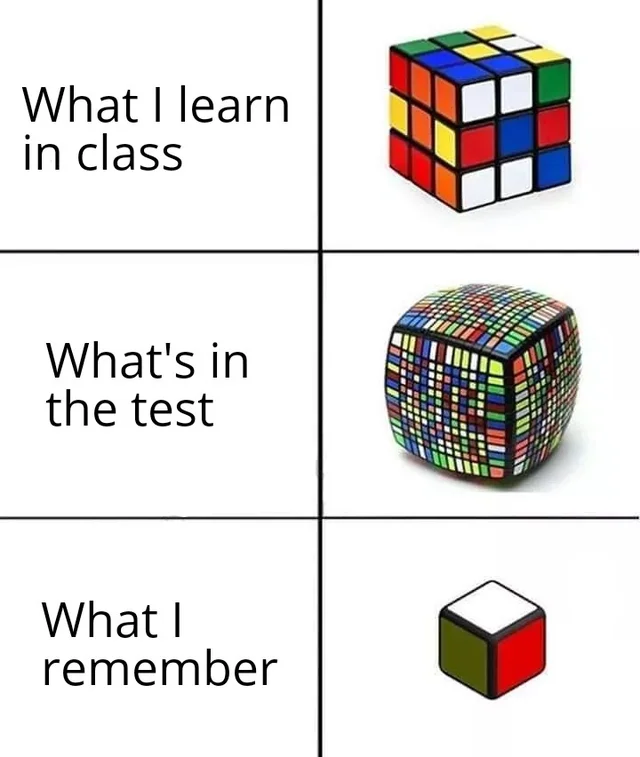

# Secure Real Time Multiplayer Game

[FCC link](https://www.freecodecamp.org/learn/information-security/information-security-projects/secure-real-time-multiplayer-game)

Some fun facts about this project:

- At the time I'm working on this, the
  [example game](https://secure-real-time-multiplayer-game.freecodecamp.rocks/)
  doesn't even work.
- We learned a bit about socket.io in
  [QA course](https://www.freecodecamp.org/learn/quality-assurance/#advanced-node-and-express),
  but none of the final project of QA is related to socket.io. And here we see
  it in the infosec final projects.
- They don't test the game's function (how could we possibly automaticcally test
  a game given only vague requirements?) They only care about the HTTP headers.
  Thus, [simpe code like this][cheat_hversion] is enough to pass the tests.

Let's build a game... later.

<!-- TODO: build a fucking game -->

I've tried some HTML game engines, but I don't think I'd put much time to it
right now.

Time spent here so far: **2.5h**
