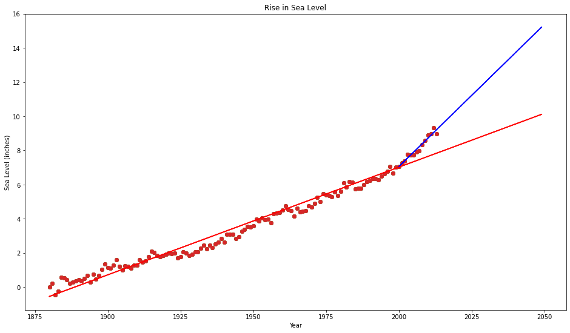

# Sea Level Predictor

## Note

- The project is educational, but, once again, the test can be very
frustrated. Thanks to [this thread](https://forum.freecodecamp.org/t/sea-level-predictor-errors/437517/13),
I could find the trick to pass the test.

Total time: 1.5h

Fuck floating point equal comparison!

## Problem description

Content of this section is copied and reformatted from [this
repl.it](https://repl.it/github/freeCodeCamp/boilerplate-sea-level-predictor),
provided by FCC
[here](https://www.freecodecamp.org/learn/data-analysis-with-python/data-analysis-with-python-projects/sea-level-predictor).

### Assignment

You will analyze a dataset of the global average sea level change since 1880.
You will use the data to predict the sea level change through year 2050.

Use the data to complete the following tasks:

- Use Pandas to import the data from `epa-sea-level.csv`.
- Use matplotlib to create a scatter plot using the "Year" column as the x-axis
  and the "CSIRO Adjusted Sea Level" column as the y-axix.
- Use the `linregress` function from `scipi.stats` to get the slope and
  y-intercept of the line of best fit. Plot the line of best fit over the top
  of the scatter plot. Make the line go through the year 2050 to predict the
  sea level rise in 2050.
- Plot a new line of best fit just using the data from year 2000 through the
  most recent year in the dataset. Make the line also go through the year 2050
  to predict the sea level rise in 2050 if the rate of rise continues as it has
  since the year 2000.
- The x label should be "Year", the y label should be "Sea Level (inches)", and
  the title should be "Rise in Sea Level".

Unit tests are written for you under `test_module.py`.

### Data Source

Global Average Absolute Sea Level Change, 1880-2014 from the US Environmental
Protection Agency using data from CSIRO, 2015; NOAA, 2015.

https://datahub.io/core/sea-level-rise


```python
# ## Solution
import pandas as pd
import matplotlib.pyplot as plt
from scipy.stats import linregress
import unittest
```


```python
def draw_plot():
    # Read data from file
    df = pd.read_csv("./epa-sea-level.csv", float_precision="legacy").rename(
        columns={
            "Year": "year",
            "CSIRO Adjusted Sea Level": "sea",
        }
    )

    # Create scatter plot
    plt.figure(1, figsize=(16, 9))
    plt.scatter(df["year"], df["sea"])

    # Create first line of best fit, with existing data
    regress = linregress(df["year"], df["sea"])

    # increase data size for future prediction
    last_year = df["year"].max()
    df = df.append([{"year": y} for y in range(last_year + 1, 2050)])
    plt.plot(
        df["year"],
        regress.intercept + regress.slope * df["year"],
        c="r",
        label="fit all",
    )

    # Create second line of best fit
    df_recent = df.loc[(df["year"] >= 2000) & (df["year"] <= last_year)]
    bestfit = linregress(df_recent["year"], df_recent["sea"])
    df_recent = df_recent.append(
        [{"year": y} for y in range(last_year + 1, 2050)]
    )
    plt.plot(
        df_recent["year"],
        bestfit.intercept + bestfit.slope * df_recent["year"],
        c="b",
        label="fit recent",
    )

    # Add labels and title
    plt.xlabel("Year")
    plt.ylabel("Sea Level (inches)")
    plt.title("Rise in Sea Level")

    return plt.gca()
```

## Test


```python
class LinePlotTestCase(unittest.TestCase):
    def setUp(self):
        self.ax = draw_plot()

    def test_plot_title(self):
        actual = self.ax.get_title()
        expected = "Rise in Sea Level"
        self.assertEqual(
            actual,
            expected,
            "Expected line plot title to be 'Rise in Sea Level'",
        )

    def test_plot_labels(self):
        actual = self.ax.get_xlabel()
        expected = "Year"
        self.assertEqual(
            actual, expected, "Expected line plot xlabel to be 'Year'"
        )
        actual = self.ax.get_ylabel()
        expected = "Sea Level (inches)"
        self.assertEqual(
            actual,
            expected,
            "Expected line plot ylabel to be 'Sea Level (inches)'",
        )
        actual = self.ax.get_xticks().tolist()
        expected = [
            1850.0,
            1875.0,
            1900.0,
            1925.0,
            1950.0,
            1975.0,
            2000.0,
            2025.0,
            2050.0,
            2075.0,
        ]
        self.assertEqual(
            actual,
            expected,
            "Expected x tick labels to be '1850.0, 1875.0, 1900.0, 1925.0, 1950.0, 1975.0, 2000.0, 2025.0, 2050.0, 2075.0'",
        )

    def test_plot_data_points(self):
        actual = self.ax.get_children()[0].get_offsets().data.tolist()
        expected = [
            [1880.0, 0.0],
            [1881.0, 0.22047244100000002],
            [1882.0, -0.440944881],
            [1883.0, -0.232283464],
            [1884.0, 0.590551181],
            [1885.0, 0.531496062],
            [1886.0, 0.43700787399999996],
            [1887.0, 0.216535433],
            [1888.0, 0.299212598],
            [1889.0, 0.362204724],
            [1890.0, 0.440944881],
            [1891.0, 0.374015748],
            [1892.0, 0.499999999],
            [1893.0, 0.6850393690000001],
            [1894.0, 0.303149606],
            [1895.0, 0.767716535],
            [1896.0, 0.46850393700000004],
            [1897.0, 0.6732283459999999],
            [1898.0, 1.043307086],
            [1899.0, 1.338582676],
            [1900.0, 1.125984251],
            [1901.0, 1.1102362190000001],
            [1902.0, 1.291338581],
            [1903.0, 1.6062992109999998],
            [1904.0, 1.2007874],
            [1905.0, 0.9842519679999999],
            [1906.0, 1.251968503],
            [1907.0, 1.196850392],
            [1908.0, 1.098425196],
            [1909.0, 1.27559055],
            [1910.0, 1.2716535420000001],
            [1911.0, 1.598425195],
            [1912.0, 1.476377951],
            [1913.0, 1.5472440930000002],
            [1914.0, 1.795275589],
            [1915.0, 2.10629921],
            [1916.0, 2.031496061],
            [1917.0, 1.854330707],
            [1918.0, 1.791338581],
            [1919.0, 1.854330707],
            [1920.0, 1.905511809],
            [1921.0, 1.988188974],
            [1922.0, 1.952755904],
            [1923.0, 1.999999998],
            [1924.0, 1.7125984230000002],
            [1925.0, 1.791338581],
            [1926.0, 2.0472440919999997],
            [1927.0, 2.003937006],
            [1928.0, 1.850393699],
            [1929.0, 1.905511809],
            [1930.0, 2.062992124],
            [1931.0, 2.0472440919999997],
            [1932.0, 2.271653541],
            [1933.0, 2.440944879],
            [1934.0, 2.228346454],
            [1935.0, 2.448818895],
            [1936.0, 2.295275588],
            [1937.0, 2.519685037],
            [1938.0, 2.6220472409999998],
            [1939.0, 2.826771651],
            [1940.0, 2.618110234],
            [1941.0, 3.098425194],
            [1942.0, 3.098425194],
            [1943.0, 3.098425194],
            [1944.0, 2.84645669],
            [1945.0, 2.95669291],
            [1946.0, 3.2519685010000003],
            [1947.0, 3.374015745],
            [1948.0, 3.562992122],
            [1949.0, 3.51181102],
            [1950.0, 3.598425193],
            [1951.0, 3.9724409410000003],
            [1952.0, 3.8700787360000004],
            [1953.0, 4.043307082],
            [1954.0, 3.929133854],
            [1955.0, 3.964566925],
            [1956.0, 3.763779524],
            [1957.0, 4.291338578],
            [1958.0, 4.346456688],
            [1959.0, 4.358267712],
            [1960.0, 4.503937003],
            [1961.0, 4.748031491],
            [1962.0, 4.543307082],
            [1963.0, 4.480314956],
            [1964.0, 4.1692913339999995],
            [1965.0, 4.6102362160000006],
            [1966.0, 4.397637791],
            [1967.0, 4.452755901000001],
            [1968.0, 4.484251963999999],
            [1969.0, 4.751968499],
            [1970.0, 4.67716535],
            [1971.0, 4.881889759],
            [1972.0, 5.240157475],
            [1973.0, 5.003937003],
            [1974.0, 5.472440939],
            [1975.0, 5.409448812999999],
            [1976.0, 5.370078735],
            [1977.0, 5.303149601],
            [1978.0, 5.555118105],
            [1979.0, 5.362204719],
            [1980.0, 5.5984251910000005],
            [1981.0, 6.0866141670000005],
            [1982.0, 5.858267711],
            [1983.0, 6.188976372000001],
            [1984.0, 6.153543301],
            [1985.0, 5.74803149],
            [1986.0, 5.771653537000001],
            [1987.0, 5.795275585],
            [1988.0, 5.980314955],
            [1989.0, 6.157480308999999],
            [1990.0, 6.2322834579999995],
            [1991.0, 6.334645663],
            [1992.0, 6.35826771],
            [1993.0, 6.291338576],
            [1994.0, 6.499999992999999],
            [1995.0, 6.618110229],
            [1996.0, 6.787401568],
            [1997.0, 7.066929127000001],
            [1998.0, 6.665354324],
            [1999.0, 7.011811016],
            [2000.0, 7.062992119],
            [2001.0, 7.287401567000001],
            [2002.0, 7.3818897560000005],
            [2003.0, 7.7598425120000005],
            [2004.0, 7.740157472000001],
            [2005.0, 7.74409448],
            [2006.0, 7.9173228270000005],
            [2007.0, 7.996062984],
            [2008.0, 8.350393692],
            [2009.0, 8.586614164],
            [2010.0, 8.901574794],
            [2011.0, 8.96456692],
            [2012.0, 9.326771643999999],
            [2013.0, 8.980314951],
        ]
        self.assertEqual(
            actual, expected, "Expected different data points in scatter plot."
        )

    def test_plot_lines(self):
        actual = self.ax.get_lines()[0].get_ydata().tolist()
        expected = [
            -0.5421240249263661,
            -0.4790794409142336,
            -0.41603485690208686,
            -0.3529902728899543,
            -0.2899456888778218,
            -0.22690110486568926,
            -0.16385652085355673,
            -0.1008119368414242,
            -0.037767352829277456,
            0.025277231182855076,
            0.08832181519498761,
            0.15136639920712014,
            0.21441098321925267,
            0.2774555672313852,
            0.34050015124351773,
            0.4035447352556645,
            0.466589319267797,
            0.5296339032799295,
            0.5926784872920621,
            0.6557230713041946,
            0.7187676553163271,
            0.7818122393284739,
            0.8448568233406064,
            0.9079014073527389,
            0.9709459913648715,
            1.033990575377004,
            1.0970351593891365,
            1.1600797434012833,
            1.2231243274134158,
            1.2861689114255483,
            1.3492134954376809,
            1.4122580794498134,
            1.475302663461946,
            1.5383472474740927,
            1.6013918314862252,
            1.6644364154983577,
            1.7274809995104903,
            1.7905255835226228,
            1.8535701675347553,
            1.9166147515468879,
            1.9796593355590346,
            2.042703919571167,
            2.1057485035832997,
            2.168793087595432,
            2.2318376716075647,
            2.2948822556196973,
            2.357926839631844,
            2.4209714236439766,
            2.484016007656109,
            2.5470605916682416,
            2.610105175680374,
            2.6731497596925067,
            2.7361943437046534,
            2.799238927716786,
            2.8622835117289185,
            2.925328095741051,
            2.9883726797531835,
            3.051417263765316,
            3.1144618477774486,
            3.1775064317895954,
            3.240551015801728,
            3.3035955998138604,
            3.366640183825993,
            3.4296847678381255,
            3.492729351850258,
            3.5557739358624048,
            3.6188185198745373,
            3.68186310388667,
            3.7449076878988024,
            3.807952271910935,
            3.8709968559230674,
            3.934041439935214,
            3.9970860239473467,
            4.060130607959479,
            4.123175191971612,
            4.186219775983744,
            4.249264359995877,
            4.312308944008024,
            4.375353528020156,
            4.438398112032289,
            4.501442696044421,
            4.564487280056554,
            4.627531864068686,
            4.690576448080819,
            4.7536210320929655,
            4.816665616105098,
            4.879710200117231,
            4.942754784129363,
            5.005799368141496,
            5.068843952153628,
            5.131888536165775,
            5.194933120177907,
            5.25797770419004,
            5.3210222882021725,
            5.384066872214305,
            5.4471114562264376,
            5.510156040238584,
            5.573200624250717,
            5.636245208262849,
            5.699289792274982,
            5.762334376287114,
            5.825378960299247,
            5.8884235443113795,
            5.951468128323526,
            6.014512712335659,
            6.077557296347791,
            6.140601880359924,
            6.203646464372056,
            6.266691048384189,
            6.329735632396336,
            6.392780216408468,
            6.455824800420601,
            6.518869384432733,
            6.581913968444866,
            6.644958552456998,
            6.708003136469145,
            6.771047720481278,
            6.83409230449341,
            6.897136888505543,
            6.960181472517675,
            7.023226056529808,
            7.086270640541954,
            7.149315224554087,
            7.2123598085662195,
            7.275404392578352,
            7.338448976590485,
            7.401493560602617,
            7.46453814461475,
            7.527582728626896,
            7.590627312639029,
            7.653671896651161,
            7.716716480663294,
            7.7797610646754265,
            7.842805648687559,
            7.905850232699706,
            7.968894816711838,
            8.03193940072397,
            8.094983984736103,
            8.158028568748236,
            8.221073152760368,
            8.284117736772515,
            8.347162320784648,
            8.41020690479678,
            8.473251488808913,
            8.536296072821045,
            8.599340656833178,
            8.66238524084531,
            8.725429824857457,
            8.78847440886959,
            8.851518992881722,
            8.914563576893855,
            8.977608160905987,
            9.040652744918134,
            9.103697328930252,
            9.166741912942399,
            9.229786496954517,
            9.292831080966664,
            9.35587566497881,
            9.41892024899093,
            9.481964833003076,
            9.545009417015194,
            9.608054001027341,
            9.671098585039488,
            9.734143169051606,
            9.797187753063753,
            9.860232337075871,
            9.923276921088018,
            9.986321505100136,
            10.049366089112283,
            10.11241067312443,
        ]
        self.assertEqual(
            actual,
            expected,
            "Expected different line for first line of best fit.",
        )
        actual = self.ax.get_lines()[1].get_ydata().tolist()
        expected = [
            7.06107985777146,
            7.227507131103323,
            7.393934404435242,
            7.560361677767105,
            7.726788951098968,
            7.89321622443083,
            8.059643497762693,
            8.226070771094555,
            8.392498044426418,
            8.55892531775828,
            8.725352591090143,
            8.891779864422006,
            9.058207137753925,
            9.224634411085788,
            9.39106168441765,
            9.557488957749513,
            9.723916231081375,
            9.890343504413238,
            10.0567707777451,
            10.223198051076963,
            10.389625324408826,
            10.556052597740688,
            10.72247987107255,
            10.88890714440447,
            11.055334417736333,
            11.221761691068195,
            11.388188964400058,
            11.55461623773192,
            11.721043511063783,
            11.887470784395646,
            12.053898057727508,
            12.220325331059371,
            12.386752604391233,
            12.553179877723153,
            12.719607151055015,
            12.886034424386878,
            13.05246169771874,
            13.218888971050603,
            13.385316244382466,
            13.551743517714328,
            13.718170791046191,
            13.884598064378054,
            14.051025337709916,
            14.217452611041836,
            14.383879884373698,
            14.55030715770556,
            14.716734431037423,
            14.883161704369286,
            15.049588977701148,
            15.216016251033011,
        ]
        self.assertEqual(
            actual,
            expected,
            "Expected different line for second line of best fit.",
        )
```


```python
if __name__ == "__main__":
    unittest.main(argv=["first-arg-is-ignored"], exit=False)
```

    ....
    ----------------------------------------------------------------------
    Ran 4 tests in 0.062s
    
    OK




