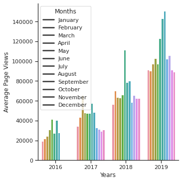
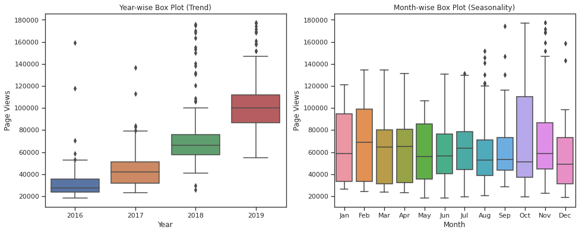
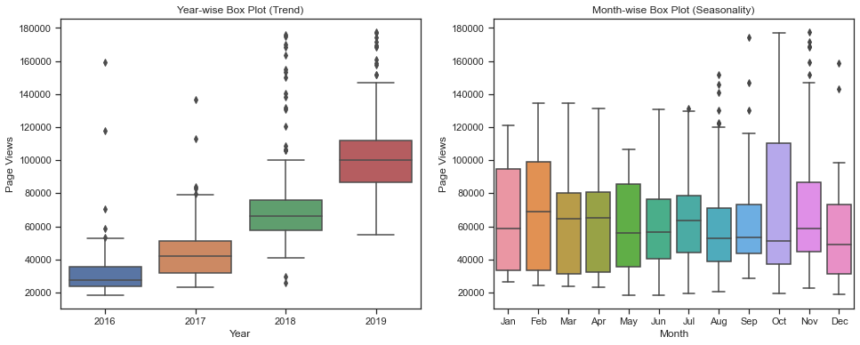
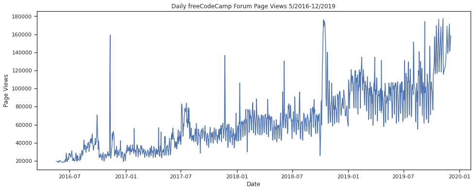

# Medical Data Visualizer

## Problem description

Content of this section is copied and reformatted from [this
repl.it](https://repl.it/github/freeCodeCamp/boilerplate-page-view-time-series-visualizer),
provided by FCC
[here](https://www.freecodecamp.org/learn/data-analysis-with-python/data-analysis-with-python-projects/page-view-time-series-visualizer).

### Assignment

For this project you will visualize time series data using a line chart, bar
chart, and box plots. You will use Pandas, Matplotlib, and Seaborn to visualize
a dataset containing the number of page views each day on the freeCodeCamp.org
forum from 2016-05-09 to 2019-12-03. The data visualizations will help you
understand the patterns in visits and identify yearly and monthly growth.

Use the data to complete the following tasks:

- Use Pandas to import the data from "fcc-forum-pageviews.csv". Set the index to
  the "date" column.
- Clean the data by filtering out days when the page views were in the top 2.5%
  of the dataset or bottom 2.5% of the dataset.
- Create a `draw_line_plot` function that uses Matplotlib to draw a line chart
  similar to "examples/Figure_1.png". The title should be "Daily freeCodeCamp
  Forum Page Views 5/2016-12/2019". The label on the x axis should be "Date" and
  the label on the y axis should be "Page Views".
- Create a `draw_bar_plot` function that draws a bar chart similar to
  "examples/Figure_2.png". It should show average daily page views for each
  month grouped by year. The legend should show month labels and have a title of
  "Months". On the chart, the label on the x axis should be "Years" and the
  label on the y axis should be "Average Page Views".
- Create a `draw_box_plot` function that uses Searborn to draw two adjacent box
  plots similar to "examples/Figure_3.png". These box plots should show how the
  values are distributed within a given year or month and how it compares over
  time. The title of the first chart should be "Year-wise Box Plot (Trend)" and
  the title of the second chart should be "Month-wise Box Plot (Seasonality)".
  Make sure the month labels on bottom start at "Jan" and the x and x axis are
  labeled correctly.

## Note

- The test cases can be very frustrating.
- The example image for box_plot is misleading, perhaps FCC have some bugs in
their code, or perhaps my code has bug. I'm not sure. If you know why they're
different, let me know.

Total time: 2.5h

## Solution


```python
import matplotlib.pyplot as plt
import pandas as pd
import seaborn as sns
import unittest
import matplotlib as mpl
import matplotlib.ticker as mticker
from pandas.plotting import register_matplotlib_converters
from datetime import datetime
```


```python
register_matplotlib_converters()
```

### Import data

Make sure to parse dates. Consider setting index column to `date`.


```python
def parse_date(x):
    return datetime.strptime(x, "%Y-%m-%d")
```


```python
df = pd.read_csv(
    "./fcc-forum-pageviews.csv",
    index_col=["date"],
    parse_dates=["date"],
    date_parser=parse_date,
)
```

### Clean data


```python
df = df.loc[
    (df["value"] >= df["value"].quantile(0.025))
    & (df["value"] <= df["value"].quantile(0.975))
]
```

### Draw line plot


```python
def draw_line_plot():
    # Draw line plot
    fig, ax = plt.subplots(figsize=(16, 6))

    ax = sns.lineplot(data=df, x="date", y="value")

    ax.set(
        xlabel="Date",
        ylabel="Page Views",
    )

    ax.set_title("Daily freeCodeCamp Forum Page Views 5/2016-12/2019")

    return fig
```

### Draw bar plot


```python
def draw_bar_plot():
    # Copy and modify data for monthly bar plot
    df_bar = (
        df.copy()
        .groupby(pd.Grouper(freq="M"))
        .mean()
        .rename(columns={"value": "avg"})
    )

    df_bar["year"] = pd.DatetimeIndex(df_bar.index).year
    df_bar["month"] = pd.DatetimeIndex(df_bar.index).strftime("%B")

    # Convert data to long form
    df_bar = pd.melt(
        df_bar,
        id_vars=["year", "month"],
        value_vars=["avg"],
    )

    sns.set_theme(style="ticks")

    # Draw the chart
    fig = sns.catplot(
        data=df_bar,
        x="year",
        y="value",
        hue="month",
        kind="bar",
        legend=False,
    )

    # Config legend, axes and title
    fig.set_xlabels("Years")
    fig.set_ylabels("Average Page Views")
    plt.legend(
        title="Months",
        loc="upper left",
        labels=[
            "January",
            "February",
            "March",
            "April",
            "May",
            "June",
            "July",
            "August",
            "September",
            "October",
            "November",
            "December",
        ],
    )
    return fig.fig
```

### Draw box plots


```python
def draw_box_plot():
    # Prepare data for box plots (this part is done!)
    df_box = df.copy().rename(columns={"value": "views"})
    df_box.reset_index(inplace=True)

    df_box["year"] = [d.year for d in df_box.date]
    df_box["month"] = [d.strftime("%b") for d in df_box.date]

    fig, (ax1, ax2) = plt.subplots(1, 2, figsize=(16, 6))

    sns.boxplot(ax=ax1, data=df_box, x=df_box["year"], y=df_box["views"])

    # Remember to edit the labels after call to seaborn.
    ax1.set(
        xlabel="Year", ylabel="Page Views", title="Year-wise Box Plot (Trend)"
    )

    sns.boxplot(
        ax=ax2,
        data=df_box,
        x=df_box["month"],
        y=df_box["views"],
        order=[
            "Jan",
            "Feb",
            "Mar",
            "Apr",
            "May",
            "Jun",
            "Jul",
            "Aug",
            "Sep",
            "Oct",
            "Nov",
            "Dec",
        ],
    )

    ax2.set_title("Month-wise Box Plot (Seasonality)")
    ax2.set_xlabel("Month")
    ax2.set_ylabel("Page Views")

    # I'm cheating here, because I don't know why the test for y ticks label
    # fail and I don't want to dig into seaborn source code.
    y_ticks = [
        "0",
        "20000",
        "40000",
        "60000",
        "80000",
        "100000",
        "120000",
        "140000",
        "160000",
        "180000",
        "200000",
    ]
    ax1.yaxis.set_major_locator(mticker.FixedLocator([int(s) for s in y_ticks]))
    ax1.set_yticklabels(y_ticks)
    return fig
```

## Test


```python
class DataCleaningTestCase(unittest.TestCase):
    def test_data_cleaning(self):
        actual = int(df.count(numeric_only=True))
        expected = 1238
        self.assertEqual(
            actual,
            expected,
            "Expected DataFrame count after cleaning to be 1238.",
        )
```


```python
class LinePlotTestCase(unittest.TestCase):
    def setUp(self):
        self.fig = draw_line_plot()
        self.ax = self.fig.axes[0]

    def test_line_plot_title(self):
        actual = self.ax.get_title()
        expected = "Daily freeCodeCamp Forum Page Views 5/2016-12/2019"
        self.assertEqual(
            actual,
            expected,
            "Expected line plot title to be 'Daily freeCodeCamp Forum Page Views 5/2016-12/2019'",
        )

    def test_line_plot_labels(self):
        actual = self.ax.get_xlabel()
        expected = "Date"
        self.assertEqual(
            actual, expected, "Expected line plot xlabel to be 'Date'"
        )
        actual = self.ax.get_ylabel()
        expected = "Page Views"
        self.assertEqual(
            actual, expected, "Expected line plot ylabel to be 'Page Views'"
        )

    def test_line_plot_data_quatity(self):
        actual = len(self.ax.lines[0].get_ydata())
        expected = 1238
        self.assertEqual(
            actual,
            expected,
            "Expected number of data points in line plot to be 1238.",
        )
```


```python
class BarPlotTestCase(unittest.TestCase):
    def setUp(self):
        self.fig = draw_bar_plot()
        self.ax = self.fig.axes[0]

    def test_bar_plot_legend_labels(self):
        actual = []
        for label in self.ax.get_legend().get_texts():
            actual.append(label.get_text())
        expected = [
            "January",
            "February",
            "March",
            "April",
            "May",
            "June",
            "July",
            "August",
            "September",
            "October",
            "November",
            "December",
        ]
        self.assertEqual(
            actual,
            expected,
            "Expected bar plot legend labels to be months of the year.",
        )

    def test_bar_plot_labels(self):
        actual = self.ax.get_xlabel()
        expected = "Years"
        self.assertEqual(
            actual, expected, "Expected bar plot xlabel to be 'Years'"
        )
        actual = self.ax.get_ylabel()
        expected = "Average Page Views"
        self.assertEqual(
            actual,
            expected,
            "Expected bar plot ylabel to be 'Average Page Views'",
        )
        actual = []
        for label in self.ax.get_xaxis().get_majorticklabels():
            actual.append(label.get_text())
        expected = ["2016", "2017", "2018", "2019"]
        self.assertEqual(
            actual,
            expected,
            "Expected bar plot secondary labels to be '2016', '2017', '2018', '2019'",
        )

    def test_bar_plot_number_of_bars(self):
        actual = len(
            [
                rect
                for rect in self.ax.get_children()
                if isinstance(rect, mpl.patches.Rectangle)
            ]
        )
        expected = 49
        self.assertEqual(
            actual,
            expected,
            "Expected a different number of bars in bar chart.",
        )
```


```python
class BoxPlotTestCase(unittest.TestCase):
    def setUp(self):
        self.fig = draw_box_plot()
        self.ax1 = self.fig.axes[0]
        self.ax2 = self.fig.axes[1]

    def test_box_plot_number(self):
        actual = len(self.fig.get_axes())
        expected = 2
        self.assertEqual(actual, expected, "Expected two box plots in figure.")

    def test_box_plot_labels(self):
        actual = self.ax1.get_xlabel()
        expected = "Year"
        self.assertEqual(
            actual, expected, "Expected box plot 1 xlabel to be 'Year'"
        )
        actual = self.ax1.get_ylabel()
        expected = "Page Views"
        self.assertEqual(
            actual, expected, "Expected box plot 1 ylabel to be 'Page Views'"
        )
        actual = self.ax2.get_xlabel()
        expected = "Month"
        self.assertEqual(
            actual, expected, "Expected box plot 2 xlabel to be 'Month'"
        )
        actual = self.ax2.get_ylabel()
        expected = "Page Views"
        self.assertEqual(
            actual, expected, "Expected box plot 2 ylabel to be 'Page Views'"
        )
        actual = []
        for label in self.ax1.get_xaxis().get_majorticklabels():
            actual.append(label.get_text())
        expected = ["2016", "2017", "2018", "2019"]
        self.assertEqual(
            actual,
            expected,
            "Expected box plot 1 secondary labels to be '2016', '2017', '2018', '2019'",
        )
        actual = []
        for label in self.ax2.get_xaxis().get_majorticklabels():
            actual.append(label.get_text())
        expected = [
            "Jan",
            "Feb",
            "Mar",
            "Apr",
            "May",
            "Jun",
            "Jul",
            "Aug",
            "Sep",
            "Oct",
            "Nov",
            "Dec",
        ]
        self.assertEqual(
            actual,
            expected,
            "Expected box plot 2 secondary labels to be 'Jan', 'Feb', 'Mar', 'Apr', 'May', 'Jun', 'Jul', 'Aug', 'Sep', 'Oct', 'Nov', 'Dec'",
        )
        actual = []

        for label in self.ax1.get_yaxis().get_majorticklabels():
            actual.append(label.get_text())
        expected = [
            "0",
            "20000",
            "40000",
            "60000",
            "80000",
            "100000",
            "120000",
            "140000",
            "160000",
            "180000",
            "200000",
        ]
        self.assertEqual(
            actual,
            expected,
            "Expected box plot 1 secondary labels to be '0', '20000', '40000', '60000', '80000', '100000', '120000', '140000', '160000', '180000', '200000'",
        )

    def test_box_plot_titles(self):
        actual = self.ax1.get_title()
        expected = "Year-wise Box Plot (Trend)"
        self.assertEqual(
            actual,
            expected,
            "Expected box plot 1 title to be 'Year-wise Box Plot (Trend)'",
        )
        actual = self.ax2.get_title()
        expected = "Month-wise Box Plot (Seasonality)"
        self.assertEqual(
            actual,
            expected,
            "Expected box plot 2 title to be 'Month-wise Box Plot (Seasonality)'",
        )

    def test_box_plot_number_of_boxs(self):
        actual = len(self.ax1.lines) / 6  # Every box has 6 lines
        expected = 4
        self.assertEqual(actual, expected, "Expected four boxes in box plot 1")
        actual = len(self.ax2.lines) / 6  # Every box has 6 lines
        expected = 12
        self.assertEqual(actual, expected, "Expected 12 boxes in box plot 2")
```


```python
if __name__ == "__main__":
    unittest.main(
        argv=["first-arg-is-ignored"],
        exit=False,
    )
```

    ...........
    ----------------------------------------------------------------------
    Ran 11 tests in 1.958s
    
    OK














