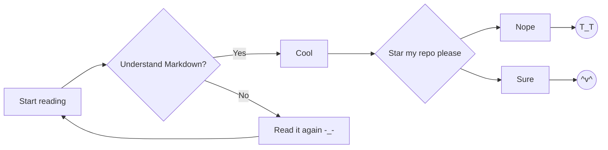

# Markdown Guide

## About this site

If you came across this by accident and wonder what freeCodeCamp has anything to
do with this page, then, it's because this page is the result to pass the [Build
a Technical Documentation Page][fcc_web_doc] on freeCodeCamp.

To run the FCC tests on this page, try reopen it with following link

https://letientai.io/freecodecamp/web/doc/?test=true

The main content on this page is actually just
[a Markdown file](https://Github.com/letientai299/freecodecamp/blob/master/web/doc/readme.md),
rendered using [marked.js](https://Github.com/markedjs/marked) with a
[custom scripts](https://Github.com/letientai299/freecodecamp/blob/master/web/doc/render-doc.js).
Original content is copied and modified from
[this gist](https://gist.Github.com/cuonggt/9b7d08a597b167299f0d) by
[cuonggt](https://Github.com/cuonggt).

Hope you enjoy this page. See also my
[other freeCodeCamp solutions](https://letientai.io/freecodecamp/).

BTW, the total time for this page is 8h, in which first 2h for setting up the
[render-doc.js][renderjs] script, the rest for content and integrate other js
libraries.

## A bit about Markdown

The
[canonical guide and also first converter for Markdown](https://daringfireball.net/projects/markdown/)
is by John Gruber, since 2004. It is short, very easy to read and understand.
But, there's one problem, his format is ambiguous, thus, each implementation
might choose to handle the ambiguities differently, lead to many issues. To
solve that, there's a community effort specification called
[CommonMark](https://commonmark.org/) aims to propose a standard, unambiguous
syntax specification for Markdown, along with a suite of comprehensive tests.
It's now considered the standard of Markdown.

That said, the formal spec by CommonMark might be too long or too technical for
you. If you just want to use it for email, social network, chat application, the
basic features should be enough.

## Where can we use Markdown?

- Most chat applications like Discord, Whatapp, Messenger, Slack, Mattermost
  support some subset of Markdown syntax. The most common ones are **bold**,
  _italic_, ~strike-through~. You might want to experiment with these
  applications to find what they can handle.

- Although Gmail doesn't directly support Markdown, there's
  [Markdown Here](https://markdown-here.com/), a cool browser extension that
  convert your Markdown text to email with just a single click.

- Developer-oriented sites like Github, Gitlab, Bicbutket should support
  Markdown to some extends. In fact, Github and Gitlab provides many additional
  syntax to help developers write great documentation.

I hope by now you are more interested in learning Markdown. So, let's move on
the Basic syntax.

## Basic syntax

### Headings

[ATX-styles](https://spec.commonmark.org/0.29/#atx-headings)

```txt
# This is an <h1> tag
## This is an <h2> tag
### This is an <h3> tag
#### This is an <h4> tag
##### This is an <h5> tag
###### This is an <h6> tag
```

[Setext-styles](https://spec.commonmark.org/0.29/#setext-heading)

```txt
This is an <h1> tag
===================

This is an <h2> tag
-------------------
```

The "Basic syntax" you just pass through is an example of `<h2>`, while the
"Headings" is a `<h3>`.

Note:

- We can't show the rendered result for above snippets because it will not look
  good in the middle of the page.
- The Setext style looks nicer in plain text, but it only supports 2 level of
  headers. So, for more consistent within your document, **stick with ATX
  style.**

### Emphasis

```txt
*This text will be italic*
_This will also be italic_

**This text will be bold**
__This will also be bold__

_You **can** combine them_
```

Result:

_This text will be italic_

_This will also be italic_

**This text will be bold**

**This will also be bold**

_You **can** combine them_

For a bit of advice, you should stick with `**` for bold and `_` for italic, so
to keep your document look consistent in plain text.

### Paragraphs

Example of a paragraph:

```txt
This sentence starts a paragraph.
This sentence in the same paragraph,
even though it is splitted in several lines.
```

Result:

This sentence starts a paragraph. This sentence in the same paragraph, even
though it is splitted in several lines.

To split the text into 2 paragraphs, we need more than 1 line break.

```txt
This sentence starts a paragraph.

The blank line between this and previous sentence
cause this line on a new paragraph.
```

Result:

This sentence starts a paragraph.

The blank line between this and previous sentence cause this line on a new
paragraph.

### Lists

#### Unordered

```txt
- Editor
  - Vim
    - Neovim
  - VSCode
  - Atom
- Tmux
```

Result:

- Editor
  - Vim
    - Neovim
  - VSCode
  - Atom
- Tmux

#### Ordered

The follow snippet

```txt
1. Learn HTML first
2. Then CSS
3. Then JS
4. Before any shiny JS frameworks
```

and this snippet (if you're lazy to increase the number)

```txt
1. Learn HTML first
1. Then CSS
1. Then JS
1. Before any shiny JS frameworks
```

Will be rendered to the same result:

1. Learn HTML first
1. Then CSS
1. Then JS
1. Before any shiny JS frameworks

### Images

Syntax:

```md

```

Example using an image on this server

```md

```

Result:


### Links

Syntax:

```md
[Link text](url).
```

Example:

```md
[freeCodeCamp solutions](https://letientai.io/freecodecamp/).
```

Result:

[freeCodeCamp solutions](https://letientai.io/freecodecamp/).

### Block quotes

```txt
> UNIX is very simple, it just needs a genius to understand its simplicity
```

Result:

> UNIX is very simple, it just needs a genius to understand its simplicity

### Horizontal Rules

```
---
```

Result:

---

### Inline code

```txt
Wrap some words with single quotation mark `like this` make an inline code
snippet.
```

Wrap some words with single quotation mark `like this` make an inline code
snippet.

### Code Snippets

```txt
    Indenting by 4 spaces will turn an entire paragraph into a code-block.
```

Result:

```txt
.my-link {
    text-decoration: underline;
}
```

In practice, you should use [Code fence](#code_fence) to get syntax-highlighting
support from popular site and tools.

### Reference Lists And Titles

```md
The quick brown [fox][1], jumped over the lazy [dog][2].

[1]: https://en.wikipedia.org/wiki/Fox "Wikipedia: Fox"
[2]: https://en.wikipedia.org/wiki/Dog "Wikipedia: Dog"
```

Result:

The quick brown [fox][1], jumped over the lazy [dog][2].

[1]: https://en.wikipedia.org/wiki/Fox "Wikipedia: Fox"
[2]: https://en.wikipedia.org/wiki/Dog "Wikipedia: Dog"

### Escaping

    \*literally\*

Result:

\*literally\*

### Embedding HTML

```html
<button>Click me</button>
```

Result:

<button onclick="function hi(){alert('Don\'t click random button on the internet. Or you will be hacked!')};hi()">
Click me
</button>

A cool trick with HTML embedding is to use
[`<detail>` and `<summary>`](https://developer.mozilla.org/en-US/docs/Web/HTML/Element/details)
to make a collapsible block like the following.

<details>
  <summary>Long list of JS frameworks, sigh</summary>
  <ul>
    <li>Angular</li>
    <li>React</li>
    <li>Vue</li>
    <li>Stelve</li>
    <li>Mithril</li>
    <li>Aurelia</li>
    <li>Preact</li>
    <li>Next</li>
    <li>Nuxt</li>
    <li>wtfjs</li>
  </ul>
</details>

## Advanced Markdown

Some of these syntaxes are not standard in CommonMark, but are widely supported.

### Strike Through

```txt
~~deleted words~~
```

Result:

~~deleted words~~

### Automatic Links

```
https://letientai.io/freecodecamp/
```

Result:

https://letientai.io/freecodecamp/

### Markdown Footnotes

Work in [Ghost](https://ghost.org/) ans some other
[static side generators](https://staticsitegenerators.net)

```txt
The quick brown fox[^1] jumped over the lazy dog[^2].

[^1]: Foxes are red
[^2]: Dogs are usually not red
```

Sadly, it doesn't work on this page.

## Github Flavored Markdown

### Code fence

<pre><code class="txt">
``javascript
function fancyAlert(arg) {
  if(arg) {
    $.facebox({div:'#foo'})
  }
}
```
</code></pre>

Result:

```javascript
function fancyAlert(arg) {
  if (arg) {
    $.facebox({ div: "#foo" });
  }
}
```

Another example using CSS

<pre><code class="txt">
```css
@media (max-width: 800px) {
  #toc {
    max-width: 200px;
  }
}
```
</code></pre>

Result:

```css
@media (max-width: 800px) {
  #toc {
    max-width: 200px;
  }
}
```

### Task Lists

```txt
- [x] Basic
- [x] Advanced
- [x] Github Flavored Markdown
- [ ] Gitlab Flavored Markdown
```

Result:

- [x] Basic
- [x] Advanced
- [x] Github Flavored Markdown
- [ ] Gitlab Flavored Markdown

### Tables

You can create tables by assembling a list of words and dividing them with
hyphens `-` (for the first row), and then separating each column with a pipe
`|`:

```txt
| Editor | Initial release | Age at 2021 |
| ------ | --------------- | ----------- |
| ed     | 1973            | 48          |
| Vi     | 1976            | 45          |
| Vim    | 1988            | 33          |
| Neovim | 2014            | 7           |
```

Result

| Editor | Initial release | Age at 2021 |
| ------ | --------------- | ----------- |
| ed     | 1973            | 48          |
| Vi     | 1976            | 45          |
| Vim    | 1988            | 33          |
| Neovim | 2014            | 7           |

You can also align column by adding `:` to left or right in the header
separator.

```txt
| Editor | Initial release | Age at 2021 |
| ------ | --------------: | ----------: |
| ed     | 1973            | 48          |
| Vi     | 1976            | 45          |
| Vim    | 1988            | 33          |
| Neovim | 2014            | 7           |
```

Result

| Editor | Initial release | Age at 2021 |
| ------ | --------------: | ----------: |
| ed     |            1973 |          48 |
| Vi     |            1976 |          45 |
| Vim    |            1988 |          33 |
| Neovim |            2014 |           7 |

If you're wonder how did I align the table column in plain text, take a look at
[prettier](https://prettier.io/)

### Commit references

Any reference to a commit’s SHA-1 hash will be automatically converted into a
link to that commit on Github. This only work somewhere in Github, such as PR or
commit message, but not on those readme docs, though.

See
[here](https://Github.com/letientai299/freecodecamp/commit/69334ecd4e1bf90ba8305bb55df3704cfc00ddf4#r48420898)
for an example.

### Issue/PR references

Any number that refers to an Issue or Pull Request will be automatically
converted into a link.

```txt
golang/go#1
```

Result (see it on Github instead):

golang/go#1

You can skip the group and repository name if you are refer to a PR/issue within
your repository.

### Username mentions

This is simlar to twitter, user `@<username>` syntax to mention someone in issue
or PR comments.

### Emoji

Github supports emoji! Check out the
[Emoji Cheat Sheet](https://www.emoji-cheat-sheet.com/).

## Gitlab Flavored Markdown

Gitlab support most, if not all, extensions that Github has and more (that means
this section won't render properly on Github).

See [Gitlab docs](https://docs.gitlab.com/ee/user/markdown.html) for more detail

Here, we will only cover some cool extensions from them (honestly, I add this
sections to just to see if I could render this page nicely like Gitlab).

### Math

It’s possible to have math written with LaTeX syntax rendered using
[KaTeX](https://github.com/KaTeX/KaTeX).

<pre><code class="txt">
If

```math
lim_{x\rightarrow 8}\frac{1}{x{-}8}=\infty
```

then

```math
lim_{x\rightarrow 5}\frac{1}{x{-}5}= ?
```
</code></pre>

If

```math
lim_{x\rightarrow 8}\frac{1}{x{-}8}=\infty
```

then

```math
lim_{x\rightarrow 5}\frac{1}{x{-}5}= ?
```

### PlantUML

[PlantUML](https://plantuml.com/) is a cool tool to generate diagram from plain
text. On Gitlab, following snippet

<pre><code class="txt">
```plantuml
A -> B: Hello
```
</code></pre>

Will become this sequence diagram

```plantuml
A -> B: Hello
```

### Mermaid

[Mermaid](https://mermaid-js.github.io/) is another tool to turn plain text into
diagram. Compare to PlantUML, it has an advantage that it's completely client
side, no need a server.

Below plain text

<pre><code class="txt">

</code></pre>

On Gitlab, will become


## Final note

We finally come to the end. I hope that you enjoy reading this, learn a few
things about Markdown and its extensions.

This page probably contains full of bugs with bad JS code (both the FE and the
[render-doc.js][renderjs] so if you found any, let me know, or, even better,
send me a PR!

<!-- ref -->

[fcc_web_doc]:
  https://www.freecodecamp.org/learn/responsive-web-design/responsive-web-design-projects/build-a-technical-documentation-page
[renderjs]:
  https://github.com/letientai299/freecodecamp/blob/master/web/doc/render-doc.js
